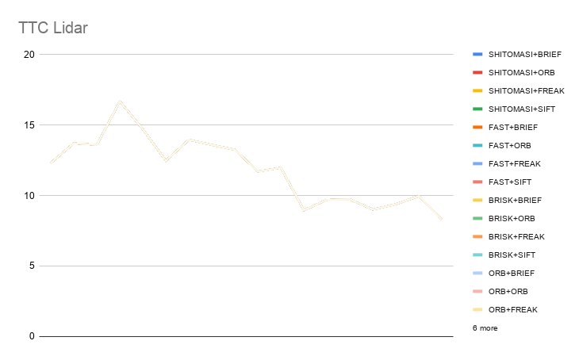
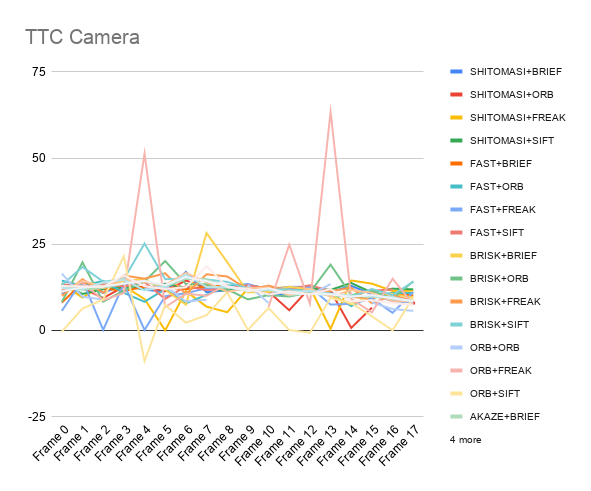
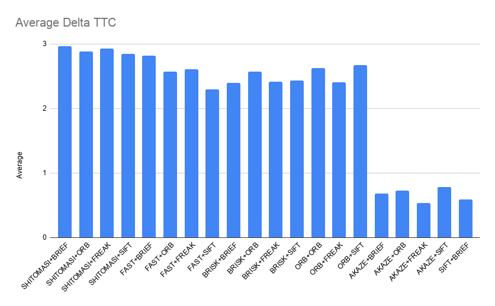

# SFND 3D Object Tracking

This is the final project from the camera module for the sensor fusion nanodegree by Udacity. This project builds on learned concepts of keypoint detectors, descriptors, and methods to match them between successive images. As well as detecting objects in an image using the YOLO deep-learning framework and associating regions in a camera image with Lidar points in 3D space 
<!---->

This project implements:

1. An algorithm to match 3D objects over time by using keypoint correspondences. 
2. Computes the Time to Collision (TTC) based on Lidar measurements. 
3. Computation of TTC using the camera, which requires to first associate keypoint matches to regions of interest and then to compute the TTC based on those matches. 
4. Performance tests to identify the most suitable detector/descriptor combination for TTC estimation and also to search for problems that can lead to faulty measurements by the camera or Lidar sensor. 

## Future work

Add Kalman filter to optimally fuse both TTC estimates

## Dependencies for Running Locally
* Git LFS
  * Weight files are handled using [LFS](https://git-lfs.github.com/)
* OpenCV >= 4.1
  * This must be compiled from source using the `-D OPENCV_ENABLE_NONFREE=ON` cmake flag for testing the SIFT and SURF detectors.

## Basic Build Instructions

1. Clone this repo.
2. Make a build directory in the top level project directory: `mkdir build && cd build`
3. Compile: `cmake .. && make`
4. Run it: `./3D_object_tracking`.

# Results

# Track an object in 3D space

1. Match 3D Objects

```cpp
void matchBoundingBoxes(std::vector<cv::DMatch>& matches, std::map<int, int>& bbBestMatches, DataFrame& prevFrame,
                        DataFrame& currFrame)
{
  std::multimap<int, int> potentialBoxMatches;
  for (auto& match : matches)
  {
    auto trainPt = currFrame.keypoints[match.trainIdx];
    auto queryPt = prevFrame.keypoints[match.queryIdx];

    auto currBBs = currFrame.boundingBoxes;
    auto prevBBs = prevFrame.boundingBoxes;
    for (auto& prevbb : prevBBs)
    {
      if (prevbb.roi.contains(queryPt.pt))
      {
        for (auto& currbb : currBBs)
        {
          if (currbb.roi.contains(trainPt.pt))
          {
            potentialBoxMatches.insert(std::pair<int, int>(prevbb.boxID, currbb.boxID));
          }
        }
      }
    }
  }
  // Count potential matches
  std::map<int, std::map<int, int>> prevBBToCurrBBcounter;  // prev -> current, count
  for (auto & [ prevbb, currbb ] : potentialBoxMatches)
  {
    ++prevBBToCurrBBcounter[prevbb][currbb];
  }
  for (auto & [ prevbb, bbCountPair ] : prevBBToCurrBBcounter)
  {
    std::map<int, int, std::greater<int>> countToBB;  // Reverse the map, so that the counts are keys. And higher counts
                                                      // occur first
    for (auto & [ bb, count ] : bbCountPair)
    {
      countToBB[count] = bb;
    }
    bbBestMatches[prevbb] = countToBB.begin()->second;
  }
}
```

2. Lidar based TTC
```cpp
void computeTTCLidar(std::vector<LidarPoint>& lidarPointsPrev, std::vector<LidarPoint>& lidarPointsCurr,
                             double frameRate, double& TTC)
{
  auto prevMinX = 100000.0;
  auto currMinX = 100000.0;
  constexpr float reflectivityThreshold = 0.4;

  std::sort(lidarPointsPrev.begin(), lidarPointsPrev.end(),
            [](const LidarPoint& lhs, const LidarPoint& rhs) { return lhs.x < rhs.x; });
  std::sort(lidarPointsCurr.begin(), lidarPointsCurr.end(),
            [&](const LidarPoint& lhs, const LidarPoint& rhs) { return lhs.x < rhs.x; });
  int medianIxPrev = lidarPointsPrev.size() / 2;
  int medianIxCurr = lidarPointsPrev.size() / 2;

  prevMinX = lidarPointsPrev[medianIxPrev].x;
  currMinX = lidarPointsCurr[medianIxCurr].x;

  auto deltaX = prevMinX - currMinX;
  auto dt = 1. / frameRate;
  auto velocity = deltaX / dt;

  TTC = currMinX / velocity;
}
```

### Lidar Time to collision (seconds)

| Frame 0 | Frame 1 | Frame 2 | Frame 3 | Frame 4 | Frame 5 | Frame 6 | Frame 7 | Frame 8 | Frame 9 | Frame 10 | Frame 11 | Frame 12 | Frame 13 | Frame 14 | Frame 15 | Frame 16 | Frame 17 |
|---------|---------|---------|---------|---------|---------|---------|---------|---------|---------|----------|----------|----------|----------|----------|----------|----------|----------|
| 12.3214 | 13.7103 | 13.6017 | 16.6894 | 14.7    | 12.4725 | 13.9617 | 13.5964 | 13.2543 | 11.7031 | 11.9758  | 8.95978  | 9.69596  | 9.72968  | 9.01266  | 9.38796  | 9.96004  | 8.29642  |

3. Associate Keypoint Correspondences with Bounding Boxes
```cpp
void clusterKptMatchesWithROI(BoundingBox& boundingBox, std::vector<cv::KeyPoint>& kptsPrev,
                              std::vector<cv::KeyPoint>& kptsCurr, std::vector<cv::DMatch>& kptMatches)
{
  std::vector<cv::DMatch> matches_in_roi;
  auto distance_mean = 0.0f;
  for (auto& match : kptMatches)
  {
    auto trainPt = kptsCurr[match.trainIdx].pt;
    auto queryPt = kptsPrev[match.queryIdx].pt;

    if (boundingBox.roi.contains(trainPt) || boundingBox.roi.contains(queryPt))
    {  
      matches_in_roi.push_back(match);
      distance_mean += match.distance;
    }
  }
  distance_mean /= kptMatches.size();
  for (auto& match : matches_in_roi)
  {
    if (std::abs(match.distance - distance_mean) / distance_mean < 5)
    {
      boundingBox.kptMatches.push_back(match);
    }
  }
}

```

4. Compute Camera-based TTC

```cpp
void computeTTCCamera(std::vector<cv::KeyPoint>& kptsPrev, std::vector<cv::KeyPoint>& kptsCurr,
                      std::vector<cv::DMatch> kptMatches, double frameRate, double& TTC, cv::Mat* visImg)
{
  std::vector<double> distanceRatios;
  for (auto& match : kptMatches)
  {
    // get current keypoint and its matched partner in the prev. frame
    auto kpOuterCurr = kptsCurr.at(match.trainIdx);
    auto kpOuterPrev = kptsPrev.at(match.queryIdx);

    for (auto it2 = kptMatches.begin() + 1; it2 != kptMatches.end(); ++it2)
    {
      auto minDist = 100.0;  // min. required distance
      // get next keypoint and its matched partner in the prev. frame
      cv::KeyPoint kpInnerCurr = kptsCurr.at(it2->trainIdx);
      cv::KeyPoint kpInnerPrev = kptsPrev.at(it2->queryIdx);
      // compute distances and distance ratios
      double distCurr = cv::norm(kpOuterCurr.pt - kpInnerCurr.pt);
      double distPrev = cv::norm(kpOuterPrev.pt - kpInnerPrev.pt);
      if (distPrev > std::numeric_limits<double>::epsilon() && distCurr >= minDist)
      {  // avoid division by zero

        double distRatio = distCurr / distPrev;
        distanceRatios.push_back(distRatio);
      }
    }  // eof inner loop over all matched kpts
  }    // eof outer loop over all matched kpts
  if (distanceRatios.size() == 0)
  {
    TTC = NAN;
    return;
  }

  std::sort(distanceRatios.begin(), distanceRatios.end());
  // compute camera-based TTC from distance ratios
  double meanDistRatio = std::accumulate(distanceRatios.begin(), distanceRatios.end(), 0.0) / distanceRatios.size();

  long medIndex = floor(distanceRatios.size() / 2.0);
  double medDistRatio = distanceRatios.size() % 2 == 0 ?
                            (distanceRatios[medIndex - 1] + distanceRatios[medIndex]) / 2.0 :
                            distanceRatios[medIndex];

  double dT = 1 / frameRate;
  TTC = -dT / (1 - medDistRatio);
}
```


5. Performance Evaluation

It was not found that the Lidar TTC estimates are very off. 

Since we choose only valid points by:
- Choosing points within a bounding box of the car
- Choosing points near the median

We get robust estimates of TTC.

Unplausible estimates could be due to considering points with low reflectivity(noise)



6. Performance Evaluation of different Detectors + Descriptors

The BRIEF + ORB detector produced a big outlier in frame 4 of the TTC collision. This could be due to considering a match which is very far away from the mean of other matches. To reduce this, we could tighten the restriction on the max distance from mean, to be considered a valid point for calculation.

Other detector+descriptor combinations also produce intermittent bad estimates. This is also due to considering points which are not located on the car in front during calculation of TTC.

The AKAZE detector + FREAK/ORB/SIFT/BRIEF is quite robust, and the TTC delta is quite low


### Camera Time To collision (s)

| X               |  Frame 0  |  Frame 1 |  Frame 2 |  Frame 3 |  Frame 4 |  Frame 5  |  Frame 6 |  Frame 7 |  Frame 8 |  Frame 9 |  Frame 10 |  Frame 11 |  Frame 12 |  Frame 13 |  Frame 14 |  Frame 15 |  Frame 16 |  Frame 17 |
|-----------------|-----------|----------|----------|----------|----------|-----------|----------|----------|----------|----------|-----------|-----------|-----------|-----------|-----------|-----------|-----------|-----------|
| SHITOMASI+BRIEF | 10.6675   | 14.0201  | 10.8792  | 13.4338  | 11.7871  | 11.3442   | 16.9725  | 11.0967  | 11.7219  | 11.8563  | 10.9042   | 10.3601   | 12.5062   | 11.1574   | 12.9494   | 10.4941   | 8.52789   | 8.26497   |
| SHITOMASI+ORB   | 11.6543   | 12.306   | 9.40562  | 12.7138  | 12.6602  | 11.4035   | 14.4895  | 12.5199  | 11.8062  | 13.2947  | 11.2783   | 5.87223   | 12.4409   | 11.5476   | 0.759864  | 6.65414   | nan       | 7.96684   |
| SHITOMASI+FREAK | 13.6073   | 9.54359  | 13.3052  | 12.9162  | 9.12442  | 0.0279351 | 11.4079  | 6.92102  | 5.30578  | 12.1722  | 12.1722   | 12.6126   | 12.5003   | 0.455977  | 14.5119   | 13.595    | 11.4707   | 11.5691   |
| SHITOMASI+SIFT  | 13.6928   | 10.5981  | 11.9502  | 12.6321  | 12.0591  | 13.5822   | 12.4166  | 12.2022  | 11.4559  | 13.1973  | 12.2052   | 11.5615   | 12.253    | 11.7928   | 13.7671   | 11.0189   | 12.1403   | 11.9395   |
| FAST+BRIEF      | 8.09631   | 13.8073  | 12.2419  | 11.4678  | 12.7031  | 12.5024   | 11.9556  | 12.8288  | 13.0459  | 11.3513  | 11.328    | 12.4711   | 11.1036   | 10.2876   | 9.71901   | 9.37082   | 10.7828   | 10.1197   |
| FAST+ORB        | 14.4598   | 12.9565  | 14.4076  | 10.9087  | 8.32701  | 12.016    | 7.88203  | 10.341   | 12.9908  | 13.422   | 10.0637   | 12.664    | 11.1507   | 10.8208   | 7.06224   | 10.1852   | 10.8622   | 10.8743   |
| FAST+FREAK      | 5.68866   | 14.6152  | 0.173919 | 13.6141  | 0.146848 | 9.9389    | 10.8132  | 12.26    | 12.191   | 13.503   | 11.7039   | 12.6733   | 12.6318   | 7.52021   | 7.72305   | 9.26986   | 5.13979   | 11.1409   |
| FAST+SIFT       | 13.4181   | 12.7779  | 13.4147  | 12.808   | 14.0211  | 9.15679   | 12.8681  | 11.7236  | 12.2131  | 13.1122  | 12.194    | 11.9904   | 13.1258   | 11.4559   | nan       | 11.5546   | 11.9072   | nan       |
| BRISK+BRIEF     | 12.8204   | 12.1609  | 12.3324  | 14.4902  | 14.8568  | 11.7989   | 7.48913  | 28.2637  | 19.8381  | 11.0809  | 11.1203   | 12.6874   | 11.9506   | 10.2366   | 7.59921   | 10.111    | 10.6356   | 9.51765   |
| BRISK+ORB       | 8.25821   | 19.773   | 8.36129  | 11.5903  | 14.2183  | 20.1499   | 13.4823  | 13.4032  | 11.9402  | 9.02383  | 10.2718   | 9.85895   | 11.0276   | 19.1167   | 10.2333   | 11.583    | 9.20794   | 14.275    |
| BRISK+FREAK     | 10.0297   | 14.8858  | 10.9375  | 15.9624  | 15.037   | 16.6      | 10.5619  | 16.3036  | 15.679   | 11.9105  | 13.0095   | 11.4112   | 11.3712   | 11.4007   | 12.412    | 7.90062   | 10.1703   | 8.60163   |
| BRISK+SIFT      | 13.1695   | 18.4412  | 14.1798  | 14.8405  | 25.2287  | 14.916    | 14.9567  | 14.8263  | 14.1029  | 12.1939  | 11.8555   | 11.9532   | 11.2045   | 10.6017   | 9.651     | 12.0506   | 10.2689   | 14.1802   |
| ORB+ORB         | 16.5128   | 9.78726  | 8.99465  | -inf     | 12.0493  | 12.9729   | 8.44907  | 8.93311  | -inf     | 13.2268  | 7.98675   | -inf      | 10.2719   | 13.4923   | -inf      | 8.10774   | 6.23047   | 5.69782   |
| ORB+FREAK       | 11.5099   | 14.0063  | 8.75564  | 10.8712  | 51.3613  | 6.76474   | 10.6973  | 10.0855  | 13.3992  | -inf     | 6.81821   | 24.8983   | 7.74427   | 63.442    | 9.12643   | 5.24767   | 15.0271   | 7.47532   |
| ORB+SIFT        | -0.326671 | 6.38181  | 8.95537  | 21.5313  | -8.90096 | 7.40133   | 2.26843  | 4.43935  | 11.0796  | 0.174976 | 6.536     | 0.114674  | -0.622458 | 9.4288    | 7.9638    | 4.10914   | 0.0346091 | 9.72992   |
| AKAZE+BRIEF     | 12.802    | 11.8159  | 12.3743  | 13.6642  | 14.1787  | 12.706    | 15.0088  | 14.8248  | 12.6245  | 11.8592  | 12.2706   | 10.1665   | 10.853    | 10.1432   | 9.87396   | 9.83105   | 9.22906   | 8.60968   |
| AKAZE+ORB       | 11.0197   | 14.4177  | 12.7183  | 14.7594  | 14.1088  | 13.1567   | 16.6967  | 13.9876  | 11.225   | 12.2401  | 12.4545   | 10.2981   | 12.0566   | 9.83687   | 11.7405   | 10.9137   | 8.50146   | 8.46466   |
| AKAZE+FREAK     | 12.3568   | 12.0586  | 13.8938  | 14.7569  | 11.6244  | 12.6893   | 16.2186  | 12.6182  | 12.4973  | 11.4903  | 11.7315   | 11.1953   | 11.5217   | 10.6071   | 10.1502   | 9.89148   | 9.74648   | 8.27266   |
| AKAZE+SIFT      | 11.3485   | 12.4912  | 12.8106  | 13.587   | 14.4113  | 13.1734   | 15.5048  | 14.3311  | 12.8912  | 11.4261  | 12.2244   | 10.7634   | 10.5576   | 10.4936   | 9.79081   | 10.2646   | 9.3491    | 8.51824   |
| SIFT+BRIEF      | 12.9114   | 12.8182  | 12.6772  | 16.0025  | 12.8326  | 12.0221   | 12.5488  | 18.6548  | 12.6465  | 12.0987  | 10.454    | 11.3524   | 10.5012   | 12.0062   | 8.48152   | 8.78524   | 7.86061   | 7.474     |


### TTC Camera(seconds)


### TTC Lidar(seconds)


### Delta TTC Average(seconds)


